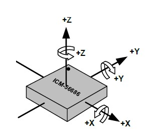
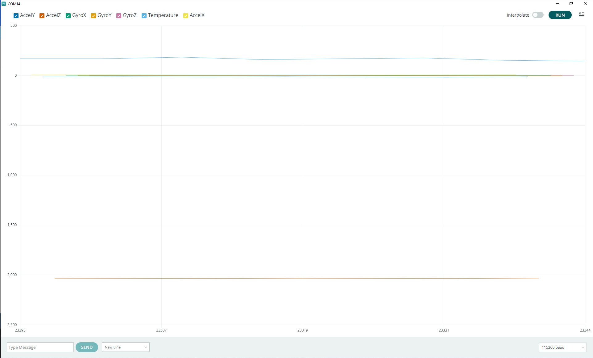

# ICM566xx Arduino library
This arduino library for the [TDK/Invensense ICM566xx High Performance 6-Axis MotionTracking<sup>(TM)</sup> IMU](https://invensense.tdk.com/en-us/consumer).
The ICM-566xx is a high performance 6-axis MEMS MotionTracking device. It has a configurable host interface that supports I3C<sup>SM</sup>, I2C and SPI serial communication, and an I2C master mode interface for connection to external sensors. The device features up to 8Kbytes FIFO and 2 programmable interrupts.
This library supports both I2C and SPI commmunication with the ICM566xx.

# Software setup
Use Arduino Library manager to find and install the ICM566xx library.

# Hardware setup
There is currently no Arduino shield for the ICM566xx.
The wiring must be done manually between the Arduino motherboard and the ICM566xx eval board.
The below wiring description is given for an Arduino Zero board, it depends on the interface to be used:
* I2C

|Arduino Zero|ICM566xx eval board|
| --- | --- |
| 5V         | CN1.19         |
| GND        | CN1.11         |
| SDA        | CN1.18         |
| SCL        | CN1.16         |

* SPI

|Arduino Zero|ICM566xx eval board|
| --- | --- |
| 5V         | CN1.19         |
| GND        | CN1.11         |
| MISO=SPI.1 | CN1.20         |
| MOSI=SPI.4 | CN1.18         |
| SCK=SPI.3  | CN1.16         |
| CS=DIG.8   | CN1.4          |

Note: SPI Chip Select can be mapped on any free digital IO, updating the sketches accordingly.

* Interrupt

|Arduino Zero|ICM566xx eval board|
| --- | --- |
| DIG.2        | CN1.3        |

Note: Interrupt pin can be mapped on any free interruptable IO, updating the sketches accordingly.

## Orientation of axes

The diagram below shows the orientation of the axes of sensitivity and the polarity of rotation. Note the pin 1 identifier (•) in the
figure.



# Library API

## Create ICM566xx instance

**ICM566xx(TwoWire &i2c,bool lsb)**

Create an instance of the ICM566xx that will be accessed using the specified I2C. The LSB of the I2C address can be set to 0 or 1.  
I2C default clock is 400kHz.

```C++
ICM566xx IMU(Wire,0);
```

**ICM566xx(TwoWire &i2c,bool lsb, uint32_t freq)**

Same as above, specifying the I2C clock frequency (must be between 100kHz and 1MHz)

```C++
ICM566xx IMU(Wire,0,1000000);
```

**ICM566xx(SPIClass &spi,uint8_t cs_id)**

Create an instance of the ICM566xx that will be accessed using the specified SPI. The IO number to be used as chip select must be specified.  
SPI default clock is 16MHz.

```C++
ICM566xx IMU(SPI,8);
```

**ICM566xx(SPIClass &spi,uint8_t cs_id, uint32_t freq)**

Same as above, specifying the SPI clock frequency (must be between 100kHz and 24MHz)

```C++
ICM566xx IMU(SPI,8,12000000);
```


**/!\ This library does NOT support multiple instances of ICM566xx.**


## Initialize the ICM566xx
Call the begin method to execute the ICM566xx initialization routine. 

**int begin()**

Initializes all the required parameters in order to communicate and use the ICM566xx.

```C++
IMU.begin();
```

## Log sensor data

**int startAccel(uint16_t odr, uint16_t fsr)**

This method starts logging with the accelerometer, using the specified full scale range and output data rate.
Supported ODR are: 1, 3, 6, 12, 25, 50, 100, 200, 400, 800 Hz (any other value defaults to 400 Hz). 
Supported full scale ranges are: 2, 4, 8, 16 G (any other value defaults to 16 G).

```C++
IMU.startAccel(100,16);
```

**int startGyro(uint16_t odr, uint16_t fsr)**

This method starts logging with the gyroscope, using the specified full scale range and output data rate.
Supported ODR are: 1, 3, 6, 12, 25, 50, 100, 200, 400, 800 Hz (any other value defaults to 400 Hz). 
Supported full scale ranges are: 250, 500, 1000, 2000 dps (any other value defaults to 2000 dps).

```C++
IMU.startGyro(100,2000);
```

**int getDataFromRegisters(inv_imu_sensor_data_t& data)**

This method reads the ICM566xx sensor data from registers and fill the provided event structure with sensor raw data.
Raw data can be translated to International System using the configured FSR for each sensor. Temperature in Degrees Centigrade = (TEMP_DATA / 128) + 25

```C++
  inv_imu_sensor_data_t imu_data;
  // Read registers
  IMU.getDataFromRegisters(imu_data);

  // Format data for Serial Plotter
  accel_g[0]  = (float)(imu_data.accel_data[0] * ACCEL_FSR_G) / MAX_LSB;
  accel_g[1]  = (float)(imu_data.accel_data[1] * ACCEL_FSR_G) / MAX_LSB;
  accel_g[2]  = (float)(imu_data.accel_data[2] * ACCEL_FSR_G) / MAX_LSB;
	      
  Serial.print("AccelX:");
  Serial.print(accel_g[0]);
  Serial.print(",");
  Serial.print("AccelY:");
  Serial.print(accel_g[1]);
  Serial.print(",");
  Serial.print("AccelZ:");
  Serial.print(accel_g[2]);
  Serial.print(","); 

  gyro_dps[0]  = (float)(imu_data.gyro_data[0] * GYRO_FSR_DPS) / MAX_LSB;
  gyro_dps[1]  = (float)(imu_data.gyro_data[1] * GYRO_FSR_DPS) / MAX_LSB;
  gyro_dps[2]  = (float)(imu_data.gyro_data[2] * GYRO_FSR_DPS) / MAX_LSB;

  Serial.print("GyroX:");
  Serial.print(gyro_dps[0]);
  Serial.print(",");
  Serial.print("GyroY:");
  Serial.print(gyro_dps[1]);
  Serial.print(",");
  Serial.print("GyroZ:");
  Serial.print(gyro_dps[2]);
  Serial.print(",");

  temp_degc = 25 + ((float)imu_data.temp_data/128);
  Serial.print("Temperature:");        
  Serial.println(temp_degc);  
```

**int enableFifoInterrupt(uint8_t intpin, ICM566xx_irq_handler handler, uint8_t fifo_watermark)**

This method initializes the fifo and the interrupt of the ICM566xx. The interrupt is triggered each time there is enough samples in the fifo (as specified by fifo_watermark), and the provided handler is called.
Any interuptable pin of the Arduino can be used for intpin.

```C++
uint8_t irq_received = 0;

void irq_handler(void)
{
  irq_received = 1;
}
...

// Enable interrupt on pin 2, Fifo watermark=10
IMU.enableFifoInterrupt(2,irq_handler,10);
```

**inv_imu_sensor_data_t**

This structure is used by the ICM566xx driver to return raw sensor data. Raw data length depend on the part. Available data is:
|Field name|description|
| --- | --- |
| accel_data[3]   | 3-axis accel raw data                  |
| gyro_data[3]    | 3-axis gyro raw data                   |
| temp_data       | Temperature raw data (2 bytes)         |

**inv_imu_fifo_data_t**

This structure is used by the ICM566xx driver to return FIFO raw sensor data. Available data is:
|Field name|description|
| --- | --- |
| header         | Mask describing available data           |
| sensor_data[3] | Single enabled sensor raw data (16 bits) |
| temp_data      | Temperature raw data (1 byte)            |

In hires mode, accel and gyro data are coded as 20-bits signed (max_lsb =* 2^(20-1) = 524288) with max FSR (32 g and 4000 dps).

## APEX functions

**int startAllApex(uint8_t intpin, ICM566xx_irq_handler handler)**

This method starts the apex algorithm.
ICM56682 - Tilt, Pedometer, SMD, R2W, Motion, Flat, Shake, FF, LowG, HighG, B2S
ICM56622 - LowG
The provided *handler* is called when a tilt event is detected.
Any interuptable pin of the Arduino can be used for *intpin*.
Parameters are optionals: if *handler* and *intpin* are omitted, no handler will be registered.

```C++
void irq_handler(void) {
  Serial.println("TILT");
}

// Accel ODR = 50 Hz and APEX Tilt enabled
IMU.startTiltDetection(2,irq_handler);

```

**int getApex_data(int apex_type, uint32_t& p1, uint32_t& p2, uint32_t& p3)**

This method gets the result from algorithm.
It returns status if detected the defined features since last call to this function.

```C++
if(IMU.getApex_data(ICM566XX_APEX_TILT))
{
  Serial.println("Tilt");
}
```

**int startWakeOnMotion(uint8_t intpin, ICM566xx_irq_handler handler)**

This method starts the Wake on Motion algorithm.
The provided *handler* is called when a movement is detected.
Any interuptable pin of the Arduino can be used for *intpin*.

```C++
volatile bool wake_up = false;

void irq_handler(void) {
  wake_up = true;
}

// APEX WoM enabled, irq on pin 2
IMU.startWakeOnMotion(2,irq_handler);
```

**int setApexInterrupt(uint8_t intpin, ICM566xx_irq_handler handler)**

This method registers an interrupt for the IMU.
The provided *handler* is called when an interrupt occurs.
Any interuptable pin of the Arduino can be used for *intpin*.

# Available Sketches

**Polling_I2C**

This sketch initializes the ICM566xx with the I2C interface, and starts logging raw sensor data from IMU registers. Sensor data can be monitored on Serial monitor or Serial plotter

**Polling_SPI**

This sketch initializes the ICM566xx with the SPI interface, and starts logging raw sensor data from IMU registers. Sensor data can be monitored on Serial monitor or Serial plotter

**FIFO_Interrupt**

This sketch initializes the ICM566xx with the I2C interface and interrupt pin D2, and starts logging raw sensor data from IMU FIFO. Sensor data can be monitored on Serial monitor or Serial plotter

**APEX_WakeOnMotion**

This sketch initializes the ICM566xx with the I2C interface and interrupt pin D2, and starts the APEX Wake on Motion. A Wake-up message is displayed on the Serial monitor when the sensor detects movement.

**APEX_Tap**

This sketch initializes the ICM566xx with the I2C interface and interrupt pin D2, and starts the APEX Tap. A Tap report is displayed on the Serial monitor each time a tap is detected.

**APEX_Events**

This sketch initializes the ICM566xx with the I2C interface and interrupt pin D2, and starts the APEX Pedometer, Tilt, Tap and Raise to wake. APEX status is displayed on the Serial monitor.

# IMU data monitoring

When the ICM566xx IMU is logging, the Accelerometer, Gyroscope and Temperature raw data can be monitored with the Arduino Serial Plotter (Tools->Serial Plotter).



# Using a different device interface

When switching from a Sketch using the I2C to another using the SPI (or the opposite), it is required to power off the device.
