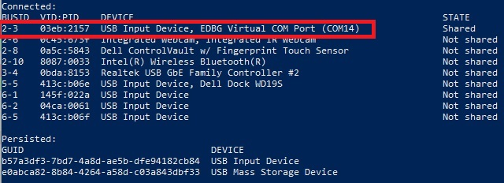
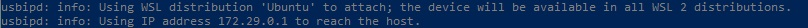
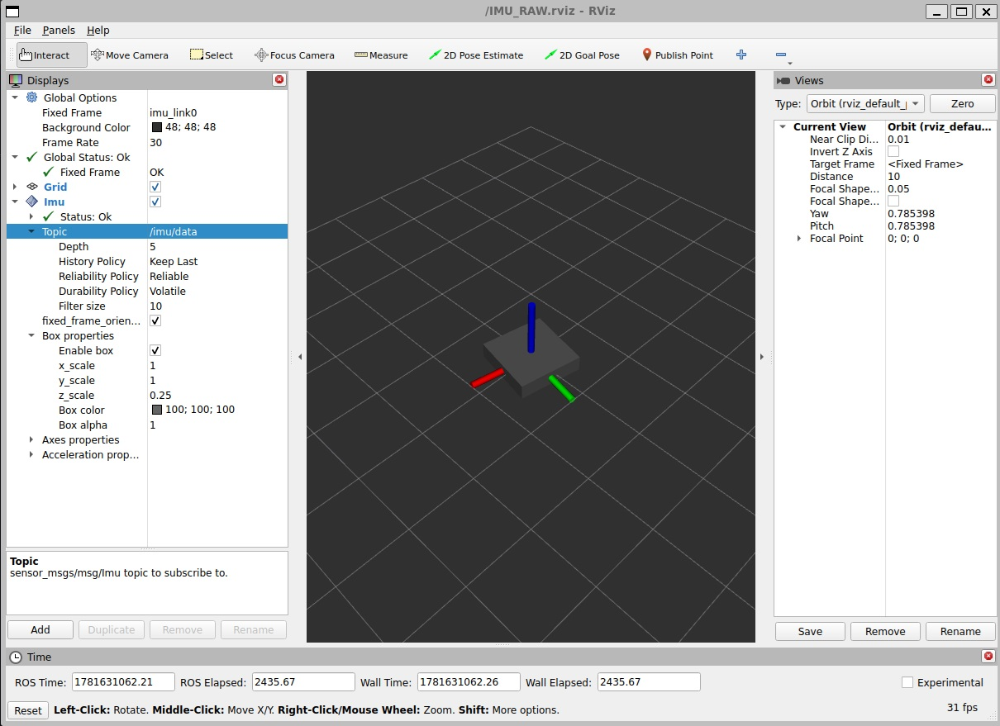

# 1 Requirements

- Arduino IDE
- Ubuntu 24.04 or WSL 2 

# 2 Windows Subsystem for Linux (WSL) 2
WSL is a feature of Windows that allows to run a Linux environment on your Windows machine.
## 2.1 Install WSL  
* Open a PowerShell Window
> PS >  wsl --install -d Ubuntu-24.04

* Then reboot your PC

* To check which version is installed, normally default is version 2
> PS >  wsl --status 

* If wsl 1 is default, Install WSL version 2
> PS > wsl --set-version Ubuntu 2  
> PS > wsl --set-default-version 2  
* Install usbipd
> PS > winget install --interactive --exact dorssel.usbipd-win

* Reboot WSL:  
Open PowerShell Window:
> PS > wsl --shutdown

# Connect Windows COM port to WSL:
It must be done each time you connect a board to Windows machine.
* Open a wsl Window:  
* Open a PowerShell Window:  
> PS > usbipd list  

> PS > usbipd bind --busid 2-3  
> PS > usbipd attach --wsl --busid 2-3  

# Verify the COM port is well connected

* In WSL Window :
>$ sudo apt install usbutils  
>$ lsusb  
Bus 001 Device 001: ID 1d6b:0002 Linux Foundation 2.0 root hub  
Bus 001 Device 003: ID 03eb:2157 Atmel Corp. EDBG CMSIS-DAP  
Bus 002 Device 001: ID 1d6b:0003 Linux Foundation 3.0 root hub  

Verify that wsl 2 can see Arduino USB port (in our case "Atmel Corp. EDBG CMSIS-DAP")

# ROS2 setup through WSL

Install ROS2 following official documentation for Ubuntu: https://docs.ros.org/en/kilted/Installation/Ubuntu-Install-Debs.html

* Set ROS_DOMAIN_ID
>$ export ROS_DOMAIN_ID=0  
>$ echo "export ROS_DOMAIN_ID=0" >> ~/.bashrc

* Set ROS_DISTRO
>$ export ROS_DISTRO=kilted  
>$ echo "export ROS_DISTRO=kilted" >> ~/.bashrc

* Display ROS environment variables 
>$ printenv | grep -i ROS

* Install ROS tool
>$ sudo apt install ros-$ROS_DISTRO-imu-tools  
>$ sudo apt install ros-$ROS_DISTRO-tf2-tools
>$ sudo apt install ros-$ROS_DISTRO-ros2-control ros-$ROS_DISTRO-ros2-controllers

# MicroROS setup through WSL

* Installing rosdep  
>$ sudo apt install python3-rosdep  
>$ source /opt/ros/$ROS_DISTRO/setup.bash

* Build micro-ROS tools and source them
>$ mkdir uros_ws && cd uros_ws 
>$ git clone -b kilted https://github.com/micro-ROS/micro_ros_setup.git src/micro_ros_setup
>$ sudo rosdep init  
>$ sudo apt update && rosdep update 
<$ sudo apt install colcon 
>$ rosdep install --from-paths src --ignore-src -y  
>$ colcon build  
>$ source install/local_setup.bash  

* To install the micro-ros Agent follow the steps below  
>$ ros2 run micro_ros_setup create_agent_ws.sh

* Build the agent packages  
>$ ros2 run micro_ros_setup build_agent.sh

# Arduino setup

Open MicroROS Arduino example
Download micro_ros_arduino 3.0.0-iron library through Arduino IDE
You can test MicroROS examples located in this repo in examples folder.

# Run Micro-ROS Agent through WSL

* Open a Linux window to connect to the ROS agent, and another one to receive message published.
* For using micro-ROS commands you need to run on both windows:
>$ source /opt/ros/$ROS_DISTRO/setup.bash  
>$ source ~/uros_ws/install/local_setup.bash

To not have to do this all the time:  
>$ echo "source /opt/ros/$ROS_DISTRO/setup.bash" >> ~/.bashrc  
>$ echo "source ~/uros_ws/install/local_setup.bash" >> ~/.bashrc  

## PowerShell
If this is not aleady done:  
> PS > usbipd attach --wsl --busid 2-3

## Window 1
* Run the Agent program   
>$ sudo chmod 777 /dev/tty<COM port number> (in our case ttyACM0)  
>$ ros2 run micro_ros_agent micro_ros_agent serial -b 1000000 --dev /dev/tty<COM port number> -v 6

* Restart the Arduino board or push reset button

## Window 2
* List the topic registered:  
>$ ros2 topic list
* Listen from the topic (might need to be repeated in some case):  
>$ ros2 topic echo /IMU_publisher

CTRL-C to stop listen  

* Launch madwick fusion using IMU raw data
>$ ros2 run imu_filter_madgwick imu_filter_madgwick_node --ros-args -r imu/data_raw:=/IMU_publisher -p use_mag:=false
## Window 3
* To see IMU moving in rviz:  
* Copy IMU_RAW.rviz file into your wsl ubuntu home path  
* Launch Rviz  
>$ ros2 run rviz2 rviz2 -d ~/IMU_RAW.rviz  

